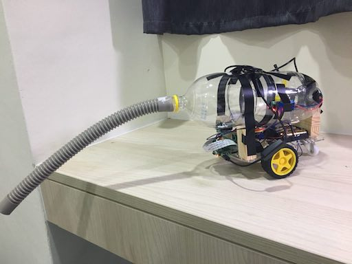
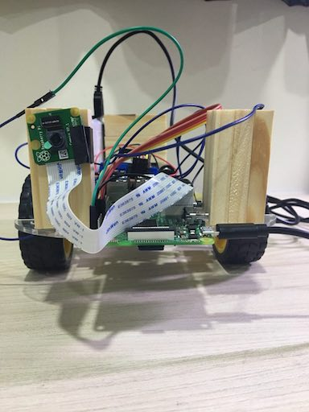

# Remote Desktop Vacuum Cleaner

## Introduction
遙控真空桌面吸塵器，是結合自製真空吸塵器與樹莓派自走車模組，利用樹莓派控制自走車及吸塵器開關，並在自走車上架設pi camera提供自走車視角畫面，讓遙控真空吸塵器即使不在使用者的視線範圍內，也可以透過網頁遙控介面，看見即時的影像去操控自走車，不僅可以吸塵，還可以享受操控遙控車的樂趣。
## Features
* 可以吸小型、輕量垃圾，清潔環境 
* 可拆卸式吸塵器，垃圾若滿了可以拆開機身，將垃圾倒掉在做使用 
* 透過網頁介面原地遙控吸塵器，不僅方便也可以享受操作的樂趣 
* 運用pi camera在網頁操控介面提供自走車視角的實時影像

## Handmade Vacuum Cleaner

### Materials
****
* 蘋果西打空瓶 x2（一個用來作拆卸的接合處） 
* 3v 小馬達風扇組（馬達轉速3000 ~ 8000 rpm，轉速不夠，推薦：36v 最高 25.5k rpm的小馬達） 
* 鐵絲（固定風扇用） 
* 電池盒 
* 一路高電位驅動繼電器（讓樹莓派控制馬達開關） 
* 塑膠管 

### Circuit Diagram
****
#### ***一路高電位驅動繼電器***
 

* IN（控制端）：接樹莓派gpio腳位（pin 16)
* VCC（電源）：接樹莓派gpio腳位輸入5v電源（pin 4)
* GND（接地）：接樹莓派gpio腳位接地（pin 9)
* NC（常閉端）：不接任何東西
* COM（公共端）：接電池盒正極
* NO（常開端）：接馬達正極
* 電池盒負極：接馬達負極

參考網址：[如何使強大的吸塵器在家裡簡單](https://m.youtube.com/watch?v=mo_Vg3Iin9Q)

## Chassis

### Materials
****
* M3 x 12mm 銅柱 x4
* M3 x 8mm 螺絲 x6
* M3 x 30mm 螺絲 x6
* M3 螺絲母 x6
* 測速盤 x2
* T 型支架 x4
* 三號電池盒(4節) x1
* 跑車輪胎，直徑 66mm x2
* 萬向輪胎 x1
* 直流馬達 x2
* 開關 x1
* 壓克力底盤，210mm(W) x 150(D) x 2.5mm(H) x1
* L298N馬達驅動模組

### Circuit Diagram
****
#### ***L298N馬達驅動模組***
 

**左馬達**

* OUT1
* OUT2

**右馬達**

* OUT3
* OUT4

**下方腳位**

* +12v：接馬達電池盒正極
* GND（接地）：接馬達電池和負極、樹莓派接地（pin 6）
* +5v：接樹莓派5v電源（pin 2）
* IN1：OUT1控制訊號輸入，接樹莓派gpio腳位（pin 12）
* IN2：OUT2控制訊號輸入，接樹莓派gpio腳位（pin 11）
* IN3：OUT3控制訊號輸入，接樹莓派gpio腳位（pin 13）
* IN4：OUT1控制訊號輸入，接樹莓派gpio腳位（pin 15）

參考網址：[Raspberry Pi樹莓派遙控車–硬體篇](http://hophd.com/raspberry-pi-remote-car-hardware/)

## Install required package and Python module

    $ sudo apt-get update
    $ sudo apt-get install -y festival python-dev python-opencv python-pip x11vnc liblivemedia-dev libv4l-dev cmake python-matplotlib vlc
    $ sudo pip install request flask numpy
    $ sudo pip install tornado
    
## Remote Control Server

使用Tornado框架實作Websocket伺服器，架設Websocket伺服器在樹莓派 8888 port ，當使用者利用網頁訪問 8888 port 時，會利用Websockt協定讓客戶端與伺服器端建立全雙工連線，使者可以於網頁端使用控制介面操作走車，當在網頁端按下對應方向按鈕，會像伺服器端傳送對應的command訊息，伺服器端會根據傳來的command去操作自走車。

***server.py***
****

	# 默認輸出皆為 False
	# 左馬達
	gpio.output(12, False) 
	gpio.output(11, False)
	
	# 右馬達
	gpio.output(13, False)
	gpio.output(15, False)
	
	# 風扇開關
	gpio.output(16, False)
 

**控制訊號**

	# 向後 command = 'b'
	gpio.output(12, False)
	gpio.output(11, True)
	gpio.output(13, False)
	gpio.output(15, True)
	# 向前 command = 'g'
	gpio.output(12, True)
	gpio.output(11, False)
	gpio.output(13, True)
	gpio.output(15, False)
	# 向左 command = 'l'
	gpio.output(12, True)
	gpio.output(11, False)
	gpio.output(13, False)
	gpio.output(15, True)
	# 向右 command = 'r'
	gpio.output(12, False)
	gpio.output(11, True)
	gpio.output(13, True)
	gpio.output(15, False)
	
	# 變數 onoff 表示目前風扇電源狀態，False為關，True為開
	if onoff == False:
		gpio.output(16, True)
		onoff = True
	else:
		gpio.output(16, False)
		onoff = False

## Camera Live Stream Server

使用Flask框架架設網頁，做出Camera object傳回目前Pi camera拍攝之照片，之後每秒呼叫camera 更新 \ tag的image，達到影像串流的效果

    $ sh camera.sh
    or
    $ sudo modprobe bcm2835-v4l2
    
    $ sudo python app-camera.py     

1. 打開pi相機權限(每次開機都要執行，於是寫一個sh方便使用)

2. 就可以在port80看到camera的影像串流

## Face Recognition

    $ sudo python capture-positives.py    
    $ python train.py     
    $ sudo python box.py
        
1. 拍下自己的臉做為訓練資料 ps.越多越好，可在./training/positive中確認

2. 開始訓練

3. 開始辨識人臉，對準相機後按下 C & ENTER，如果在誤差值內就會顯示辨識成功

4. 如果臉孔要被成功辨識，電腦的辨認信賴指數必須要低於2000，如果你的臉孔與訓練用影像相符，但是信賴指數過高，你可以在config.py （在POSITIVE_THRESHOLD設定中）調整門檻數值。如果還是不行，建議你可以試著放入更多訓練用影像，並再次執行訓練程式。這個專題使用的臉孔辨識演算法對光線很敏感，所以，試著將光線維持在訓練階段的亮度（或者也可以加入更多不同光線下的訓練影像）

## How To
製作完真空吸塵器、組裝完自走車並且將電路和腳位都接好後，把製作完成的吸塵器和自走車結合在一起，再加上利用行動電源做為樹莓派的電源，遙控桌面真空吸塵器就製作好了！

製作完畢後，在和樹莓派同一個網域下，利用ssh連上樹莓派（必須事先設定樹莓派連上Wifi，並得知樹莓派的ip位址），開啟Camera Live Stream Server以及Remote Control Server，開啟後用手機或是電腦，連上和樹莓派同一個網域的網路，就可以自瀏覽器訪問樹莓派的 8888 port，對自走車進行操控。

	# 於project的根目錄下操作
	
	# 開啟 Camera Live Stream Server
	$ sudo sh camera.sh
	$ sudo python face/app-camera.py
	
	# 開啟 Remote Control Server
	$ sudo python car/server.py

### 網頁遙控介面
****

## Work Assignment
* 彭泰淇 - 自走車製作、真空吸塵器製作（一代、二代）、Remote Control Server、網頁遙控介面、結合自走車和真空吸塵器、電子材料購買
* 游思愉 - 真空吸塵器製作（一代、二代、三代）、結合自走車和真空吸塵器、電子材料購買
* 凌浩維 - Camera Live Stream Server、Face Recognition、網頁遙控介面、結合自走車和真空吸塵器
* 楊舜丞 - 真空吸塵器製作（三代）、Camera Live Stream Server、結合自走車和真空吸塵器、真吸塵器材料購買
* 范均泓 - 認識泰國妹子、介紹泰國妹子

## Reference
[camera-python-opencv](https://github.com/raspberrypi-tw/camera-python-opencv) 
[pi-facerec-box](https://github.com/tdicola/pi-facerec-box) 
[如何使強大的吸塵器在家裡簡單](https://m.youtube.com/watch?v=mo_Vg3Iin9Q) 
[Raspberry Pi樹莓派遙控車–硬體篇](http://hophd.com/raspberry-pi-remote-car-hardware/) 
